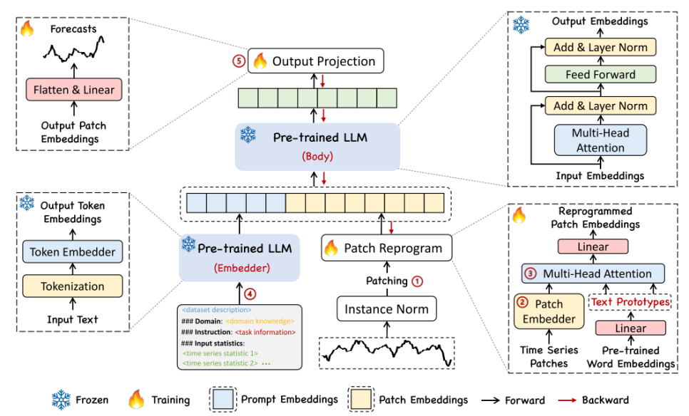

# **[ICLR2024]Time-LLM: Time Series Forecasting by Reprogramming Large Language Models** 

## **1. Problem Definition**  

 시계열 데이터 예측은 전통적인  AR, MA, ARIMA부터 현대의 Deep-Learning을 활용한 CNN, LSTM 등 많은 모델에서 연구되어 오고 있다. 하지만, 모델을 학습 시킬 수 있는 시계열 데이터가 부족하여 주로 예측하는 모델이 domain specialized되어 있는 경우가 많다. 최근 연구에 따르면 LLM(Large Language Models)이 복잡한 Token sequence에 대해 강력한 패턴 인식 및 추론 능력을 가지고 있는 것으로 밝혀졌다. 본 논문에서는 이런 LLM의 패턴 인식과 추론 능력을 시계열 예측에 사용하고자 하지만, LLM이 가지고 있는 강점을 시계열 데이터에 사용하기에는 적절한 modality 변환이 필요한 상황이다. 

 이런 문제 상황을 해결하기 위해 본 연구는 LLM의 backbone은 그대로 유지하면서 일반적인 시계열 예측을 진행할 수 있게하는 Reprogramming Framework를 제시한다. 크게 두 가지의 방법을 제시하는데, 먼저 시계열 데이터를 LLM의 능력이 강화될 수 있도록 Embedding, Patching을 거친 후 Text vector들과 합쳐주는 Patch Reprogramming이 있고, 그 후에 시계열 데이터의 Context나 해결해야 하는 Task의 정보, 적당한 Statistics를 Input에 합쳐주는 Prompt as Prefix가 존재한다. 이 두 가지 특별한 Process를 통해 시계열 데이터가 LLM을 통해 좋은 성능의 예측이 가능하다는 것을 보여준다.

## **2. Background**  

### **2.1. Time Series for LLM**

 Time-Series for LLM의 의미는 LLM의 속의 구조를 고정시키고, Downstream task에 대한 Fine-tuning을 진행하기보다 시계열 데이터에 주요한 변화를 주면서 Task의 성능을 높이고자 한다. 본 논문 또한, LLM에 변화를 취하기 보다는 시계열 데이터를 manipulation하는 방법을 사용한다. 이전에 LLM을 활용한 연구(Time Series Forecasting with LLMs: Understanding and Enhancing Model Capabilities, 2024, Jin) 를 살펴보자면,  Human knowledge를 미리 LLM에 추가한다면 예측의 성능이 높아지며 Sequence나 Numerical한 데이터를 LLM이 잘 이해할 수 있도록 Paraphrasing 하는 것 또한 긍정적인 효과를 불러온다는 결과가 있다.

 예를 들어, 전력량 예측에 대한 Task가 존재할 때 LLM에 미리 여름과 겨울에 전기를 많이 사용한다는 사실을 입력한다면 미래의 전력량 예측에 도움을 준다. 또한, 시계열 데이터를 input으로 사용할 때 시점 t에서 시점 t+1은 증가, 시점 t+1에서  시점 t+2은 감소처럼 이런 sequence에 대한 부연 설명을 통해 LLM이 시계열 데이터를 더 잘 이해할 수 있다.

 본 연구에서도 이와 유사한 개념으로 Prompt as Prefix와 Pre-trained word embedding을 사용하기에, 위의 예시를 참고하면 더욱 연구 Process를 이해하기 쉬울 것이다.

### **2.2. Consideration Time Series for LLM**

 ㄱ) 시계열 데이터 자체가 많이 존재하지 않는다.

 가장 큰 문제는  2024년 현재까지 시계열 데이터 셋 중 가장 크다고 여겨지는 것의 용량이 10GB 미만으로 Vision, NLP 등 다른 분야에 비해 Foundation Model을 학습시킬 데이터가 현저하게 부족하다.그렇기에 이를 해결하기 위해 GAN 같은 방법을 사용하거나 LLM 자체를 Domain에 따라 미리 Prompt를 넣어주기도 한다. 

 ㄴ) 각 시계열 데이터셋의 특징이나 모양이 상이하다. 

 먼저, Domain마다 데이터셋마다 통계적인 특성이나 Scale에서 차이가 난다. 예를 들어 제조 과정에서 얻어지는 변동성의 정도와 금융 시장의 변동성은 차원이 다른 수준이기에 이를 한 번에 통합하여 학습시키기 힘들다. 

 두 번째로 Granularity의 문제가 있다. 풀어서 얘기하자면 데이터의 time-step이 각 데이터 셋마다 다르다는 의미이다. 

## **3. Method**  

### **3.1. Model Setting**

위의 그림이 전체적인 모델의 Framework를 보여준다. 크게 Model Setting, Patch Reprogramming, Prompt as Prefix, Output Generation파트로 나눠지게 된다.
먼저 Model Setting 파트를 보게 된다면, Multivariae Time Series Data를 변수별로 나누고 Window Size만큼 input으로 사용한다.

$$ \huge \mathbf{X} \in \mathbb{R}^{N \times T} \rightarrow \mathbf{X}^{(i)} \in \mathbb{R}^{1 \times T} $$

 이후 각 단변수 시계열 데이터마다 Normalization을 진행한다. 이는 시계열 데이터가 주로 시간 변화에 따라 Distribution이 바뀌는 문제때문에 진행하는데, 이런 Distribution shift는 Forecating model이  generalization되지 않게 만드는 원인이다. 본 논문에서는 Reversible Instance Normalization(RevIN)을 사용하여 이 Distribution shift 현상을 해결하는데, 이는 따로 논문이 존재하니 더 자세히 알고 싶다면 아래의 논문을 참고하면 좋다.
 
[RevIN](https://openreview.net/forum?id=cGDAkQo1C0p "Reversible Instance Normalization")

## **4. Experiment**  

In this section, please write the overall experiment results.  
At first, write experiment setup that should be composed of contents.  

### **Experiment setup**  
* Dataset  
* baseline  
* Evaluation Metric  

### **Result**  
Then, show the experiment results which demonstrate the proposed method.  
You can attach the tables or figures, but you don't have to cover all the results.  
  

## **5. Conclusion**  

Please summarize the paper.  
It is free to write all you want. e.g, your opinion, take home message(오늘의 교훈), key idea, and etc.

---  
## **Author Information**  

* Author name  
    * Affiliation  
    * Research Topic

## **6. Reference & Additional materials**  

Please write the reference. If paper provides the public code or other materials, refer them.  

* Github Implementation  
* Reference  

